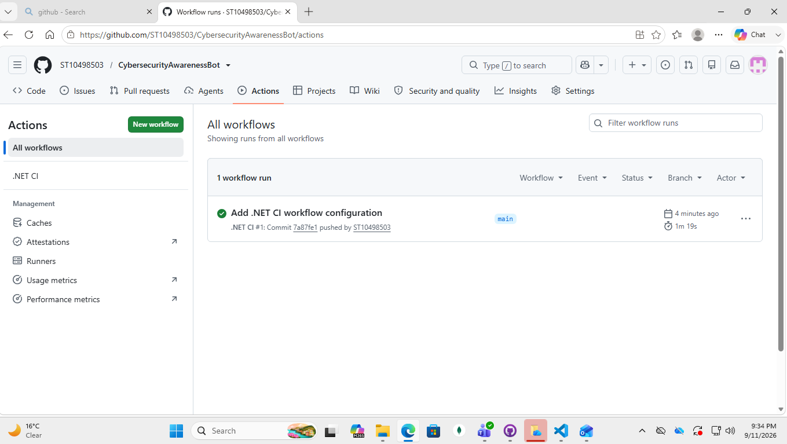

# CybersecurityAwarenessBot

## Student Name:
Yolanda

## Student Number:
ST10498503

## Project Description

The Cybersecurity Awareness Chatbot is a C# console application designed to educate South African citizens about basic cybersecurity awareness. The chatbot provides information about password safety, phishing, suspicious links and safe browsing practices.

## Features

- Voice greeting
- ASCII art
- Personalised greeting
- Password safety responses
- Phishing responses
- Suspicious link responses
- Safe browsing responses
- Input validation
- Conversation loop
- Coloured console interface

## How to Run

1. Clone or download the repository.
2. Open the solution in Visual Studio.
3. Ensure that greeting.wav is available in the Audio folder.
4. Build the project.
5. Press Ctrl + F5 to run the application.

## Requirements

- Visual Studio
- .NET 8
- Windows audio support

## GitHub Actions

A GitHub Actions workflow is included to automatically restore and build the project when changes are pushed to GitHub.

A screenshot of the successful CI result will be added below.

